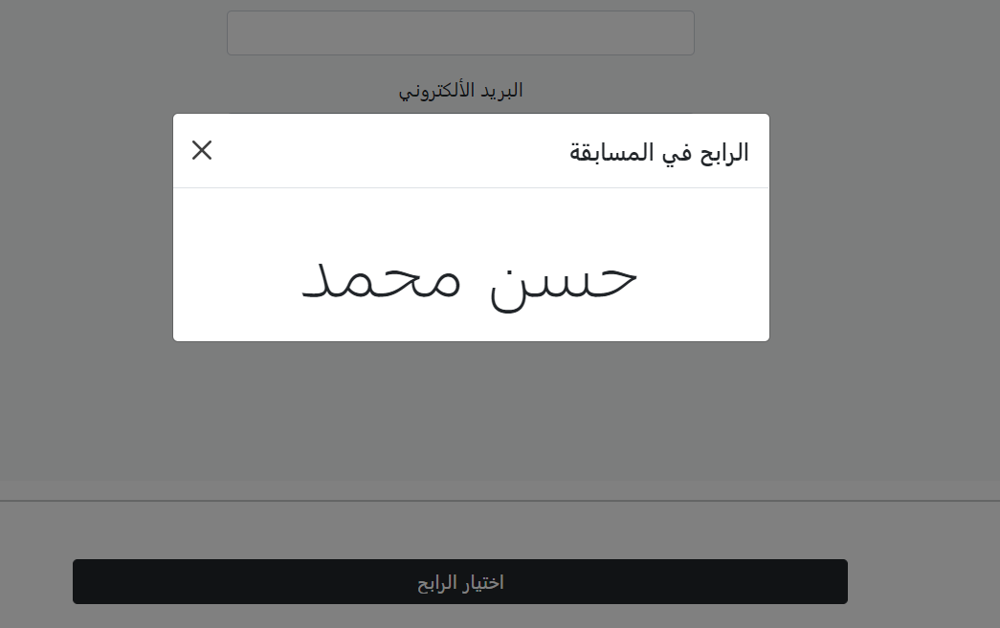

# Who's Winner ??

who's gonna win ? random winner choosing system from the database. written in PHP , MySQL &amp; Bootstrap.

<h1 align="center">How to run/use this?</h1>

make a new mysql table and insert: firstName - lastName - email

go to db folder and edit database.php .. set your [host , user , password , database name].

After that start index.php on a local server. you can use any software you like to do this for me i used MAMP.

 

<h1 align="center">🎈 Screen Shots: </h1>

 

 

 

<h1 align="center">THAT'S IT 👌🪐.</h1> 

